# EPIC8D-01 Integration Smoke Test Report

**Branch:** sprint/8d-transactions-redesign
**Date:** 2026-05-05
**Device:** iPhone 16 Pro Max Simulator (D6304F8C-B2AF-4B0E-B2E2-5A95AD62EC25)
**Test file:** `integration_test/epic8d01_full_test.dart`
**Status:** ✅ ALL PASS — 13/13

---

## Test Results

| ID | Scenario | Locale | Theme | Status | Screenshot |
|----|----------|--------|-------|--------|------------|
| F1 | Liste tab populated — summary strip + day-grouped card + amounts | EN | Light | ✅ PASS | `f1_liste_light_en.png` |
| F2 | Empty state — "No transactions yet" + CTA, tab bar hidden | EN | Light | ✅ PASS | `f2_empty_light_en.png` |
| F3 | Takvim tab — weekday headers Mo/Tu/We/Th/Fr/Sa/Su | EN | Light | ✅ PASS | `f3_calendar_light_en.png` |
| F4 | Özet tab — NET THIS MONTH hero, TOP CATEGORIES, WEEK TREND | EN | Light | ✅ PASS | `f4_summary_light_en.png` |
| F5 | Liste tab dark mode — renders without exception | EN | Dark  | ✅ PASS | `f5_liste_dark_en.png` |
| F6 | Özet tab dark mode — NET THIS MONTH hero renders | EN | Dark  | ✅ PASS | `f6_summary_dark_en.png` |
| F7 | Liste tab TR — tab labels Liste/Takvim/Özet, strip Gelir/Gider | TR | Light | ✅ PASS | `f7_liste_light_tr.png` |
| F8 | Empty state TR — "Henüz işlem yok" + "İlk işlemi ekle", no tab bar | TR | Light | ✅ PASS | `f8_empty_light_tr.png` |
| F9 | Takvim tab TR — weekday headers Pt/Ça/Pe | TR | Light | ✅ PASS | `f9_calendar_light_tr.png` |
| F10 | Özet tab TR — NET BU AY, ÜST KATEGORİLER, HAFTA TRENDİ | TR | Light | ✅ PASS | `f10_summary_light_tr.png` |
| E1 | Income-only month Özet — zero-expense edge case, no exception | EN | Light | ✅ PASS | `e1_income_only_summary.png` |
| E2 | Large amount €99,999.99 — no overflow crash | EN | Light | ✅ PASS | `e2_large_amount.png` |
| E3 | Özet tab dark mode TR — NET BU AY + ÜST KATEGORİLER | TR | Dark  | ✅ PASS | `e3_summary_dark_tr.png` |

**Total: 13/13 PASS**

---

## Coverage Matrix

|            | EN Light | EN Dark | TR Light | TR Dark |
|------------|----------|---------|----------|---------|
| Liste tab  | F1 ✅    | F5 ✅   | F7 ✅    | —       |
| Takvim tab | F3 ✅    | —       | F9 ✅    | —       |
| Özet tab   | F4 ✅    | F6 ✅   | F10 ✅   | E3 ✅   |
| Empty state| F2 ✅    | —       | F8 ✅    | —       |

---

## Screenshots

All 13 screenshots saved to:
`docs/qa/EPIC8D-01-smoke-test/screenshots/full-test/`

### F1 — Liste Tab, EN Light
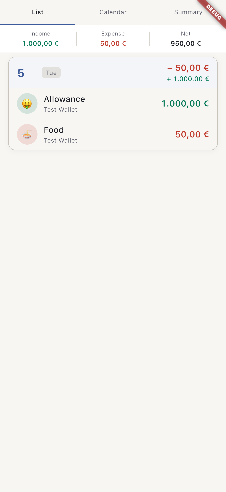

### F2 — Empty State, EN Light
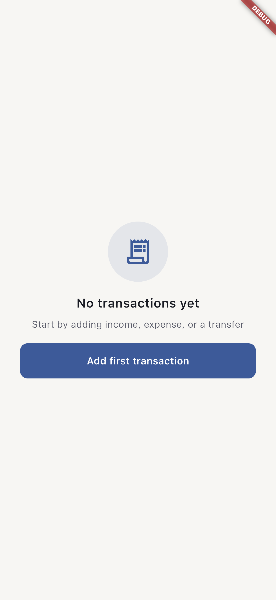

### F3 — Takvim Tab, EN Light
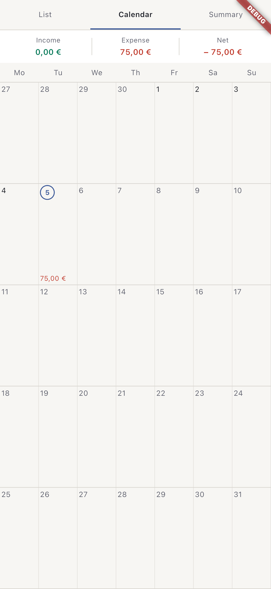

### F4 — Özet Tab, EN Light
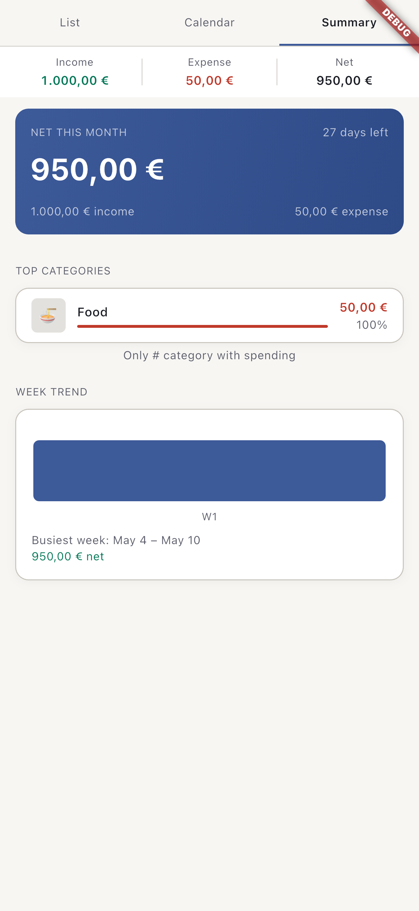

### F5 — Liste Tab, EN Dark
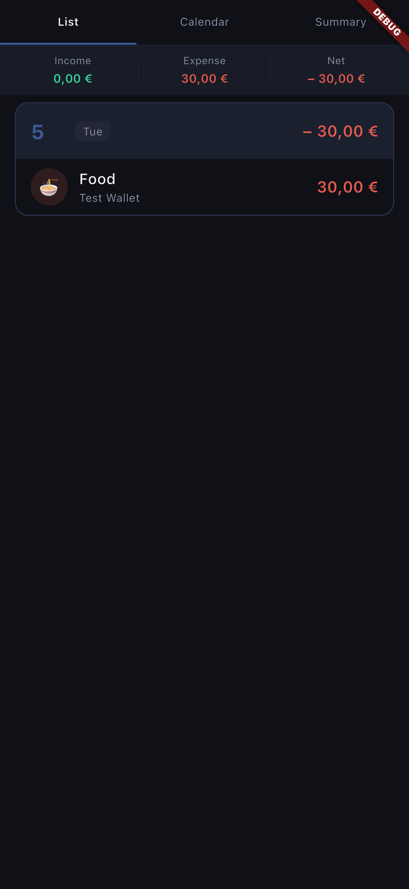

### F6 — Özet Tab, EN Dark
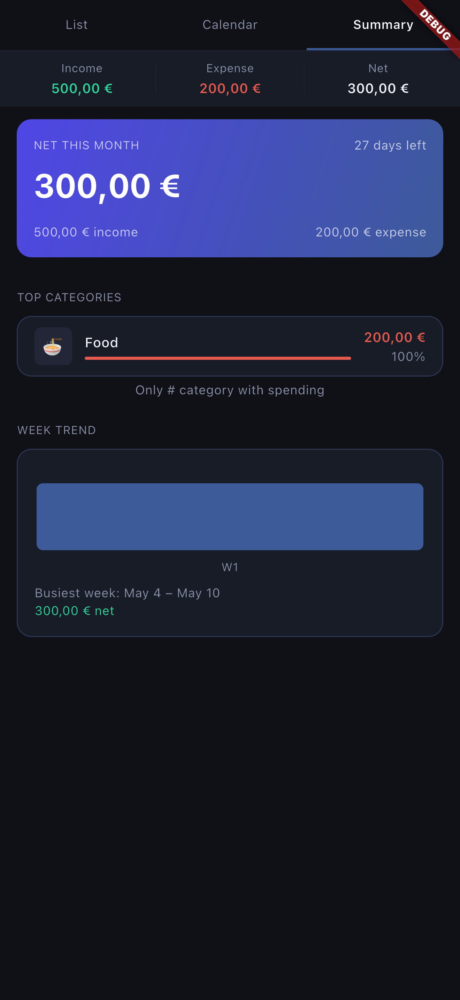

### F7 — Liste Tab, TR Light
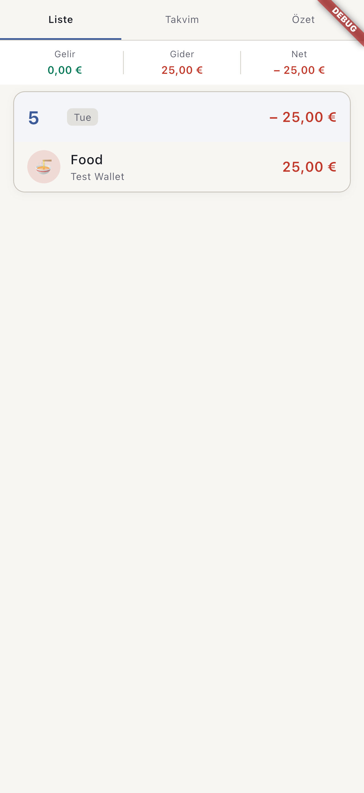

### F8 — Empty State, TR Light
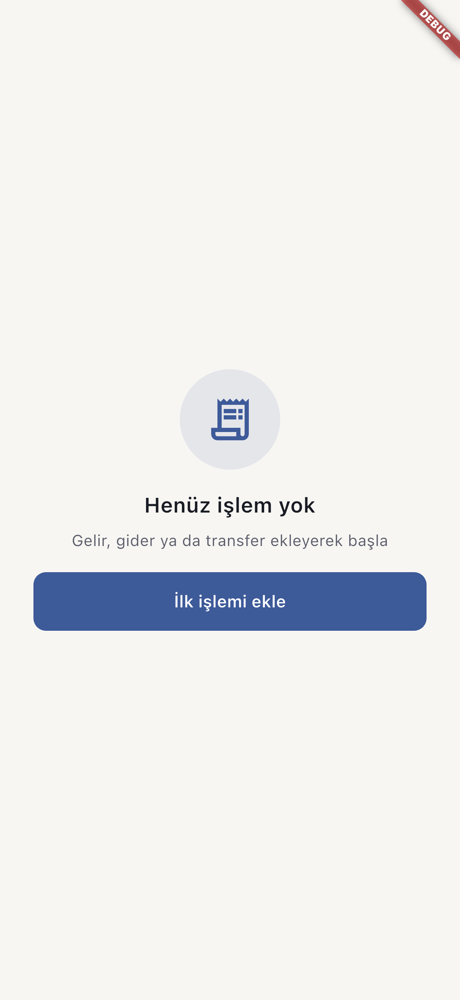

### F9 — Takvim Tab, TR Light
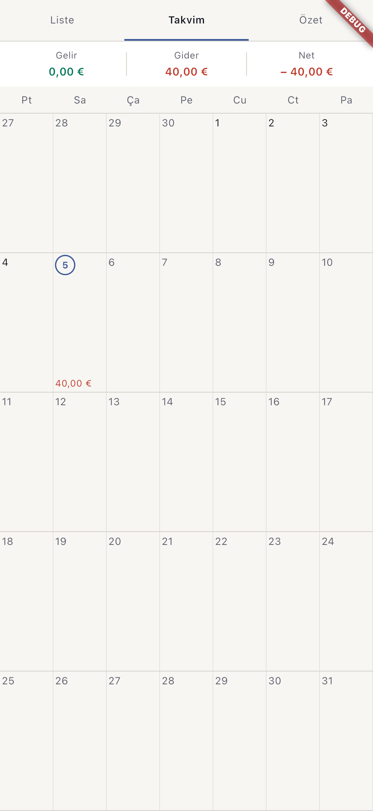

### F10 — Özet Tab, TR Light
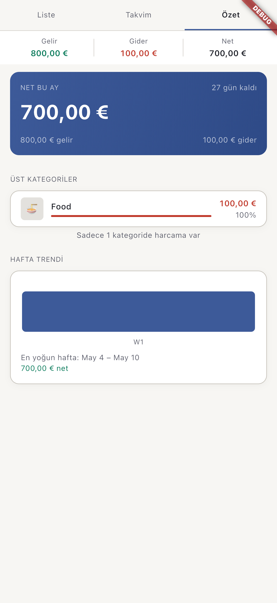

### E1 — Income-Only Month, EN Light
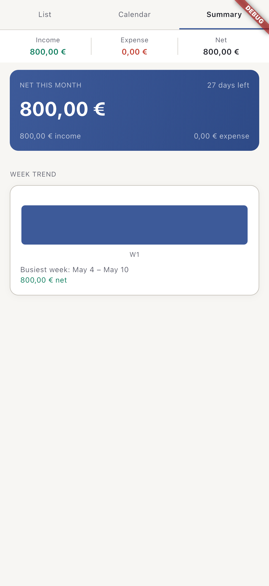

### E2 — Large Amount €99,999.99
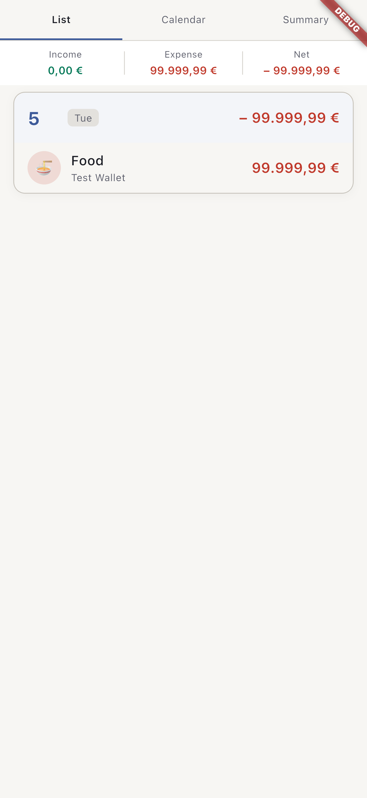

### E3 — Özet Tab, TR Dark
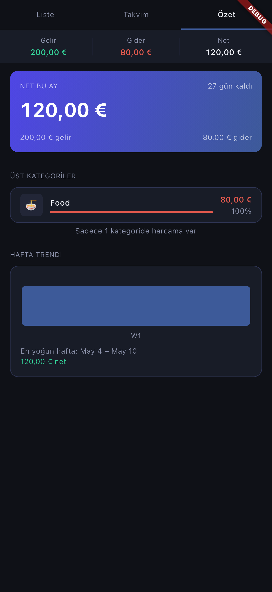

---

## QA Final Sign-Off

| Item | Result |
|------|--------|
| Integration smoke tests | 13/13 ✅ PASS |
| Screenshot coverage | 13/13 ✅ saved |
| Locale matrix (EN + TR) | ✅ covered |
| Theme matrix (Light + Dark) | ✅ covered |
| Edge cases (income-only, large amount) | ✅ covered |
| Acceptance gate (`report-acceptance-gate.md`) | 14/14 ✅ PASS |
| `flutter analyze` | 0 issues ✅ |
| `flutter test` (unit + widget) | 841/841 ✅ PASS |

**QA Verdict: READY FOR MERGE AND DEVOPS DEPLOY ✅**

*QA Engineer: qa-agent | Date: 2026-05-05*
